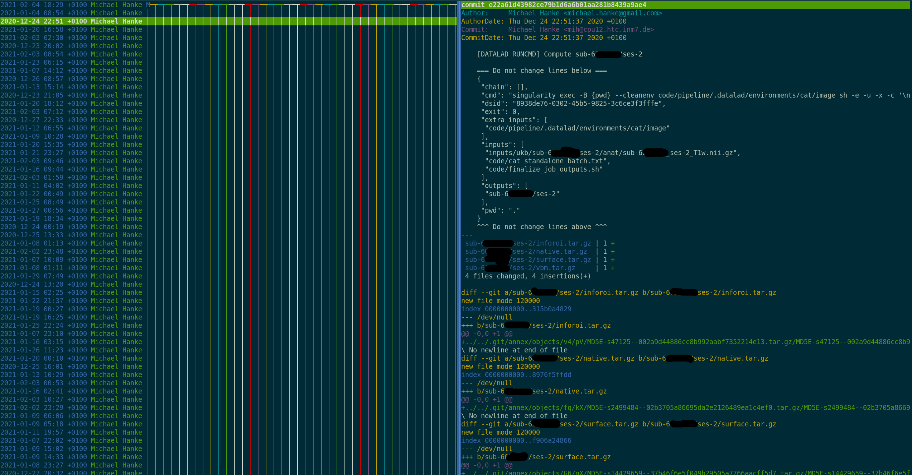

# A template for decentralized, reproducible processing

This repository contains all materials described in Wierzba et al. (2021) and
can be used as a template to set up similar processing workflows.

Please cite the corresponding publication when using this workflow or materials
from it, as well as its underlying software tools.

- [ADD Wierzba et al. 2021]
- [datalad](https://zenodo.org/record/4495661#.YEuShCUo8UE):
  Hanke, Michael, Halchenko, Yaroslav O., Poldrack, Benjamin, Meyer, Kyle, Solanky, Debanjum Singh, Alteva, Gergana, … Nichols, B. Nolan. (2021, February 2). datalad/datalad: ## 0.14.0 (February 02, 2021) (Version 0.14.0). Zenodo. http://doi.org/10.5281/zenodo.4495661

This repository contains the following files:

- ``bootstrap_test.sh``: A self-contained example analysis with HTCondor with
  openly shared structural MRI data from the Studyforrest project and a
  structural pipeline. It requires minimal adjustments of file paths to your
  filesystem, and can be ran as a quick example provided the software
  requirements are met.
- ``tutorial.md``: A tutorial to setup a self-contained analysis from
  ``bootstrap_test.sh``
- ``bootstrap.sh``: This script bootstraps the analysis workflow from scratch
  presented in Wierzba et al. (2021) from scratch. Running it requires UKBiobank
  data and a CAT software container. You can use this file or
  ``bootstrap_test.sh`` to adjust the workflow to your usecase - please edit
  anything with a "FIX-ME" mark-up.
- ``ukb_cat_processing.md``: A tutorial that describes the necessary procedures
  to reproduce the CAT-based UK-Biobank processing in Wierzba et al.
- ``code_cat_standalone_batchUKB.txt``: A Batch file for CAT12 processing. This
  script is relevant to setup the CAT12 processing pipeline reported in
  [Wierzba et al., 2021]()
- ``finalize_job_outputs``: A script that wraps up CAT processing outputs into
  tarballs


# Table of contens


<!--ts-->
* [Software requirements](#software-requirements)
* [Workflow overview](#workflow-overview)
* [Original analysis of Wierzba et al.](#Reproduce-wierzba-et-al.)
* [Adjust the workflow to your own needs](#adjust-the-workflow)
    * [Create a container dataset](#Create-a-container-dataset)
    * [Create an input dataset](#Create-an-input-dataset)
    * [Bootstrapping the framework](#Bootstrapping-the-framework)
    * [Testing your setup](#testing-your-setup)
    * [Job submission](#job-submission)
    * [After workflow completion](#after-workflow-completion)
* [Common problems and how to fix them](#Common-problems-and-how-to-fix-them)
* [Frequently asked questions](#Frequently-asked-questions)
* [Further workflow adjustments](#further-workflow-adjustments)
* [Further information](#further-reading)

<!--te-->

## Software requirements

The machines involved in your workflow need the following software:

- [datalad](https://www.datalad.org/) and its dependencies (Installation
  instructions are at [handbook.datalad.org](http://handbook.datalad.org/en/latest/intro/installation.html#install)).
  Make sure that you have recent versions of DataLad, git-annex, and Git.
- [datalad-container](http://docs.datalad.org/projects/container/en/latest/index.html#),
  a DataLad extension for working with containerized software environments that
  can be installed using [pip](https://pip.pypa.io/en/stable/): ``pip install datalad-container``.
- [Singularity](https://sylabs.io/docs/)
- The Unix tool [flock](https://linux.die.net/man/1/flock) for file locking
- A job scheduling/batch processing tool such as [HTCondor](https://research.cs.wisc.edu/htcondor/) or
  [SLURM](https://slurm.schedmd.com/documentation.html)

Make sure to have a Git identity set up (see Installation instructions of
DataLad for more info).

## Workflow overview

The framework uses a set of flexible software tools for data, code, and
computing management to apply established workflows from software development to
data analyses.
It consists of tools that on their own perform valuable key tasks for handling
digital files, such as version control for large and small data, distributed
data transport logistics, automated digital provenance capture, and parallel job
scheduling, and combines them into an adaptable setup for reproducible and
auditable science.
On a conceptual level, our framework is a scaffolding that sets up file system
infrastructure to conduct a (containerized) data analysis in a lean, distributed
network.
In this network, parallel analysis parts are individual, fully version-controlled
development histories that can be aggregated (merged) into a main analysis
revision history, in a similar way to how code is collaboratively developed with
distributed version control tools.



The framework performs complex tasks, and is highly adaptable.
A user can decide which and how much actionable digital provenance about data
transformations is captured during this analysis, enabling the potential for
full computational reproducibility.

The figure below illustrates all relevant locations and elements of the
workflow.


A bootstrapping script will assemble an analysis dataset (top left) based on
- input data
- containerized software environment
- optional additional scripts or files

This dataset is a fully self-contained analysis, and includes a job submission
setup for HTCondor or SLURM based batch processing.
By default, the computational jobs operate on a per-subject level.

During bootstrapping, two RIA stores (more information at
[handbook.datalad.org/r.html?RIA](http://handbook.datalad.org/r.html?RIA)) are
created, one temporary input store used for cloning the analysis (top left), and one
permanent output store used for collecting the results (middle, center).
The analysis dataset (top left) is pushed into each store.

After bootstrapping, a user can navigate into the analysis dataset that is
created under the current directory. Based on available job scheduling system, an
HTCondor DAG or a SLURM batch file can be submitted (see HTCondor or SLURM
specific instructions for a step-by-step submission guide).

The jobs (right handside of the image) will clone the analysis dataset into
temporary locations, retrieve the relevant subset of data for a participant-based
job, and push their results - data and process provenance separately - into the
output store.
Digital provenance (Git history) is pushed separately from data and with a file
locking mechanism to reduce concurrency issues that could arise when more than
one branch is pushed at the same time.

After the jobs finished successfully, a user consolidates the results (merges
all result branches) and restores file availability (relinks Git history and
result data) (lower left corner).
All results of the computation and their provenance are then accessible
from the output store.

We recommend to read and compute the tutorial described in ``tutorial.md`` as a
small analysis to test the workflow.
It uses open data and pipelines, and should be able to run on a system with
fulfilled software requirements with only minimal adjustments.

## Reproduce Wierzba et al.

Instructions how to reproduce the UK Biobank computation reported in Wierzba et
al. are described in ``ukb_cat_processing.md``


## Adjust the workflow

You can adjust the workflow to other datasets, systems, and pipelines.
Before making major adjustments, we recommend to try the analysis with the
tutorial provided in this repository in order to ensure that the workflow works
in principle on your system.

The workflow is tuned towards analyses that operate on a per participant level.
The adjustment is easiest if you have an input dataset with a BIDS-like structure
(sub-xxx directories on the first level of your input dataset), because the job
submission setup for HTCondor and SLURM works by finding subject directories and
building jobs based on these identifiers. If your input data is differently
structured, make sure to adjust the ``find`` command in the relevant section of
the bootstrapping script.

We highly recommend to use the workflow for computational jobs that can run
fully in parallel and do not write to the same file. Otherwise, you will see
merge conflict in data files. This can be solved in simple cases (see
[here](http://handbook.datalad.org/en/latest/beyond_basics/101-171-enki.html#merging-results)
for an example), but requires experience with Git.

We also recommend to tune your analysis for computational efficiency and minimal
storage demands. Optimize the compute time of your pipeline, audit carefully
that only relevant results are saved and remove unnecessary results right within
your pipeline, and, if necessary, wrap job results into tarballs.

### Create a container dataset

There is a public dataset with software containers available at
[https://github.com/repronim/containers](https://github.com/repronim/containers).
You can install it as a subdataset and use any of its containers - the tutorial
showcases an example of this.

When you want to build your own container dataset, create a new dataset and add a
container from a local path or URL to it.

Create a dataset:
```
$ datalad create pipeline
$ cd pipeline
```

Add a software-container to the dataset using ``datalad containers-add`` from
the ``datalad-container`` extension. The ``--url`` parameter can be a local
path to your container image, or a URL to a container hub such as Dockerhub or
Singularity Hub.

```
$ datalad containers-add cat --url <path/or/url/to/image>  \
  --call-fmt "singularity run -B {{pwd}} --cleanenv {img} {cmd}"
```

After linking the container to your analysis dataset, the bootstrap script will
add the container to the top-level analysis dataset.
Make sure to supply the correct call-format configuration to this call.
The call format configures how your container is called during the analysis, and
it can be for example used to preconfigure bind-mounts.
By default, a software container will be called with ``singularity exec
<image>``. In order to customize this invocation, for example into ``singularity
run <image> <customcommand>``, use the ``--call-fmt`` argument. Above, the
invocation is customized to bindmount the current working directory into the
container, and execute a command instead of the containers' runscript.
A different example of this is also in the tutorial in this repository, and
another example can be found at
[handbook.datalad.org/en/latest/r.html?OHBM2020](handbook.datalad.org/en/latest/r.html?OHBM2020).
More general information on call-formats can be found in the
[documentation of ``datalad containers-add``](http://docs.datalad.org/projects/container/en/latest/generated/man/datalad-containers-add.html).


### Create an input dataset

There are more than 200TB of public data available as DataLad datasets at
[datasets.datalad.org](http://datasets.datalad.org/), among them popular
neuroimaging datasets such as any dataset on
[OpenNeuro](http://handbook.datalad.org/r.html?OpenNeuro) or the [human
connectome project open access dataset](https://github.com/datalad-datasets/human-connectome-project-openaccess).
The tutorial uses such a public dataset.

If your data is not yet a DataLad dataset, you can transform it into one with
the following commands:

```
# create a dataset in an existing directory
$ datalad create -f .
# save its contents
$ datalad save . -m "Import all data"
```

This process can look different if your dataset is very large or contains
private files. We recommend to read
[handbook.datalad.org/beyond_basics/101-164-dataladdening.html](http://handbook.datalad.org/en/latest/beyond_basics/101-164-dataladdening.html)
for an overview on how to transform data into datasets.


### Bootstrapping the framework

When both input dataset and the container are accessible, the complete analysis
dataset and job submission setup can be bootstrapped using ``bootstrap.sh``.
All relevant adjustments of the file are marked with a "FIX-ME" comments.

``bootstrap.sh`` creates a range of files while it is ran.
Among others, it will setup a ``code/participant_job.sh`` file. This file is at
the heart of the computation, and should be a fully portable, self-contained
script. You should only need to adjust the ``datalad containers-run`` call in
this file in order to parametrize your pipeline or run your scripts.

If you need custom scripts or other files (such as licenses), you can included
them into the bootstrap procedure, or save them into your analysis dataset after
it has been bootstrapped.

### Testing your setup

We advise to test the setup with a handful of jobs before scaling up. In order
to do this:

- Submit a few jobs
- Make sure they finish successfully and check the logs carefully for any
  problems
- Clone the output dataset and check if all required branches are present
- Attempt a merge
- restore file availability information
- attempt a rerun

If these steps succeed, you can scale up and submit all jobs to your system.

### Job submission

The workflow can be used with or without job scheduling software. For a
single-participant job, the script ``code/participant_job.sh`` needs to be
called with a source dataset, a participant identifier, and an output location.
``bootstrap.sh`` contains a setup for HTCondor and SLURM.

When using job scheduling systems other than HTCondor or SLURM, you will need to
create the necessary submit files yourself. The ``participant_job.sh`` should
not need any adjustments. We would be happy if you would contribute additional
job scheduling setups with a pull request.

#### HTCondor submission

If your HTC/HPC systems run HTCondor, the complete analysis can be submitted as a
Directed Acyclic Graph.
The bootstrapping script will have created the necessary files - by default,
jobs are parallelized over subject directories, and specified inside of the file
``code/process.condor_dag``. Job requirements, job-internal environment
variables, and submission setup are specified in ``code/process.condor_submit``.
If you have adjusted your job setup and
requirements in the bootstrapping script, you can submit the jobs inside of the
created analysis dataset like this:

```
# create a directory for logs (it is gitignored)
$ mkdir -p dag_tmp
# copy the dag into this directory
$ cp code/process.condor_dag dag_tmp/
# submit the DAG. -maxidle 1 slides the jobs into the system smoothly instead of
# all at once. Change the batch name and maxidle parameter, if you want to
condor_submit_dag -batch-name UKB -maxidle 1 dag_tmp/process.condor_dag
```

#### SLURM submission

If your HTC/HPC systems run SLURM, the complete analysis submission is built from
the following set of files that are created during bootstrapping:

- ``code/all.jobs`` defines individual computations (by default, subject-wise)
- ``code/process.sbatch`` defines the compute environment (requires user input!)
- ``code/call.job`` defines the job setup and teardown as well as
  (adjustable/extandable) job-internal environment variables
- ``code/runJOB.sh`` performs the job submission in user-defined split sizes

Please check these files carefully for placeholder FIX-ME annotations.
If you have adjusted your job setup and requirements in the bootstrapping
script, you can submit the jobs by executing ``code/runJOB.sh``.

## After workflow completion

As described in more detail in Wierzba et al. (2021), the results of the
computation exist on separate branches in the output dataset.
They need to be merged into the main branch and connected to the result data in
the storage sibling of the RIA remote.

### Merging branches

1. Clone the output dataset from the RIA store into a temporary location.

You can find out which ID the dataset has in the RIA store by running ``datalad
-f '{infos[dataset][id]}' wtf -S dataset`` in the analysis dataset.

```
$ cd /tmp
# adjust the url to your file system and dataset id
$ datalad clone 'ria+file:///data/project/ukb/outputstore#155b4ccd-737b-4e42-8283-812ffd27a661' merger
[INFO   ] Scanning for unlocked files (this may take some time)
[INFO   ] Configure additional publication dependency on "output-storage"
configure-sibling(ok): . (sibling)
install(ok): /tmp/merger (dataset)
action summary:
  configure-sibling (ok: 1)
  install (ok: 1)

$ cd merger
```

2. Sanity checks

The branches were predictably named and start with a ``job-`` prefix.
Check the number of branches against your expected number of jobs:

```
$ git branch -a | grep job- | sort | wc -l
42767
```

It is advised to do additional checks whether the results have actually
been computed successfully, for example by querying log files. If the scripts
shared in this repository have only been altered at ``FIX-ME`` positions, you
should find the word "SUCCESS" in every job that was pushed successfully.
In order to check if a job has computed a result (some participants may lack the
relevant files and thus no output is produced in a successful job), compare its
most recent commit to the commit that identifies the analysis source dataset
state prior to computation. Where it is identical, the compute job hasn't
produced new outputs.

```
# show commit hash of the main development branch (replace with main if needed)
$ git show-ref master | cut -d ' ' -f1
46faaa8e42a5ae1a1915d4772550ca98ff837f5d
# query all branches for the most recent commit and check if it is identical.
# Write all branch identifiers for jobs without outputs into a file.
$ for i in $(git branch -a | grep job- | sort); do [ x"$(git show-ref $i \
  | cut -d ' ' -f1)" = x"46faaa8e42a5ae1a1915d4772550ca98ff837f5d" ] && \
  echo $i; done | tee /tmp/nores.txt | wc -l
```

3. Merging

With the above commands you can create a list of all branches that have results
and can be merged. Make sure to replace the commit hash with that of your own
project.

```
$ for i in $(git branch -a | grep job- | sort); \
  do [ x"$(git show-ref $i  \
     | cut -d ' ' -f1)" != x"46faaa8e42a5ae1a1915d4772550ca98ff837f5d" ] && \
     echo $i; \
done | tee /tmp/haveres.txt
```


If there are less than 5000 branches to merge, you will probably be fine by
merging all branches at once. With more branches, the branch names can exceed
your terminal length limitation. In these cases, we recommend merging them in
batches of, e.g., 5000:

```
$ git merge -m "Merge computing results (5k batch)" $(for i in $(head -5000 ../haveres.txt | tail -5000); do echo origin/$i; done)
```

Please note: The Merging operations progressively slow down with a large amount
of branches. When merging ~40k branches in batches of 5000, we saw the following
merge times (in minutes) for the batches:
15min,  22min, 32min, 40min, 49min, 58min, 66min
Depending on your system and analysis, this can take longer.

4. Push the merge back

After merging, take a look around in your temporary clone and check that
everything looks like you expect it to look. Afterwards, push the merge back
into the RIA store with Git.

```
$ git push
```

### Restoring file availability info

After merging result branches, we need to query the datastore special remote for
file availability.
This information was specifically "lost" in the compute jobs, in order to avoid
the implied synchronization problem across compute jobs, and to boost throughput.
Run the following command to restore it:

```
$ git annex fsck --fast -f output-storage
```

Sanity check that we have a file content location on record for every annexed
file by checking that the following command does not have any outputs:

```
$ git annex find --not --in output-storage
```

This will update the ``git-annex`` branch and all file contents retrievable via
datalad get.
We advise to declare the local clone dead, in order to avoid this temporary
working copy to get on record in all future clones:

```
$ git annex dead here
```

Finally, write back to the datastore:


```
$ datalad push --data nothing
```

At this point, the dataset can be cloned from the datastore, and its file
contents can be retrieved via ``datalad get``. A recomputation can be done on a
per-file level with ``datalad rerun``.
The input RIA store can be removed, if you want to.

If you want to recompute analyses for individual subjects, query the Git history
for commit shasum of individual jobs, and plug them into a ``datalad rerun``
command (see the tutorial for a quick demo).

If you want to recompute the full sample, resubmit all jobs in the analysis
dataset, using the existing setup.
Perform the same merge operation, and check for result changes in the Git
history.

## Common problems and how to fix them

**Protocol mismatches**
RIA URLs specify a protocol, such as ``ria+file://``, ``ria+http://``, or
``ria+ssh``. If this protocol doesn't match the required access protocol (for
example because you created the RIA input or output store with a ``ria+file://``
URL but computations run on another server an need a ``ria+ssh://`` URL), you
will need to reconfigure. This can be done with an environment variable
``DATALAD_GET_SUBDATASET__SOURCE__CANDIDATE__101<name>=<correct url>``. You can
find an example in the bootstrap file and more information in
[handbook.datalad.org/r.html?clone-priority](handbook.datalad.org/en/latest/r.html?clone-priority).

**Heavy Git Object stores**
With many thousand jobs, the object store of the resulting dataset can
accumulate substantial clutter. This can be reduced by running ``git gc`` from
time to time.

Please get in touch by filing an issue for further questions and help.

## Frequently asked questions

**What is filelocking and what do I need to do?**
File locking is used as the last step in any computation during the final "git
push" operation. It prevents that more than one process push their results at
the same time by holding a single shared lockfile for the duration of the
process, and only starting the process when the lockfile is free.
You will not need to create, remove, or care about the lockfile, the setup in
``bootstrap.sh`` suffices.


## Further workflow adjustments

The framework and its underlying tools are versatile and flexible. When
adjusting the workflow to other scenarios please make sure that no two jobs
write results to the same file, unless you are prepared to handle resulting
merge conflicts. An examples on how to fix simple merge conflicts is at
[handbook.datalad.org/beyond_basics/101-171-enki.html#merging-results](http://handbook.datalad.org/en/latest/beyond_basics/101-171-enki.html#merging-results).


## Further reading

More information about DataLad, the concepts relevant to this workflow, and
additional examples can be found at
[handbook.datalad.org](http://handbook.datalad.org)
